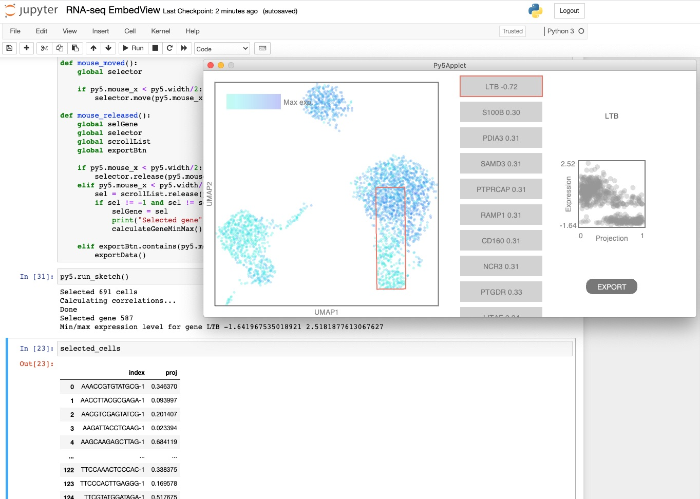
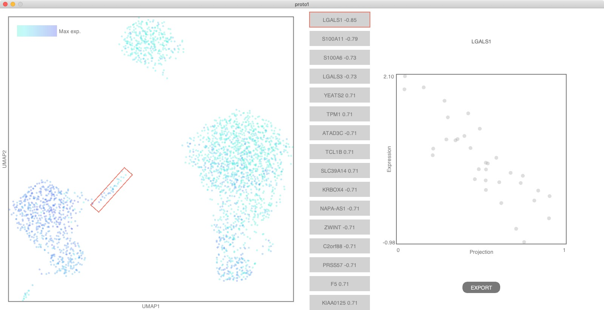

# RNA-seq Embedding Viewer

This prototype of an RNA-seq Embedding Viewer allows exploring an UMAP embedding of single-cell RNA-seq data. The user can select directions in the UMAP plane, and the viewer will calculate the genes with the highest correlation with those directions. It is available as a stand-along Processing sketch and as a Jupyter notebook.

## Jupyter notebook

This Jupyter notebook demonstrates the use of [py5](http://py5.ixora.io/), a version of Processing for Python, to create an interactive viewer of RNA-seq embedding data. Find it under the notebook folder.

Processing's drawing API and engine can be run from a Jupyter notebook to enable users explore their datasets and then bring the results of their exploration directly into the notebook for further analysis:

The datasets can be quite large, as seen in the next image:

## Processing sketch

The viewer can be run as a Processing sketch, or export from the PDE as a stand-alone application. Its functionality is identical to the Jupyter notebook. Available under the standalone folder.

